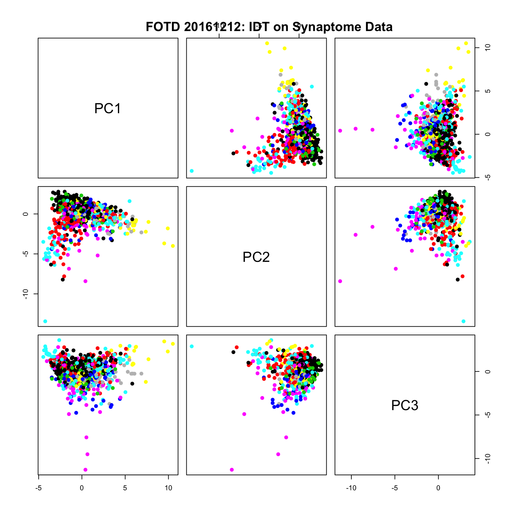
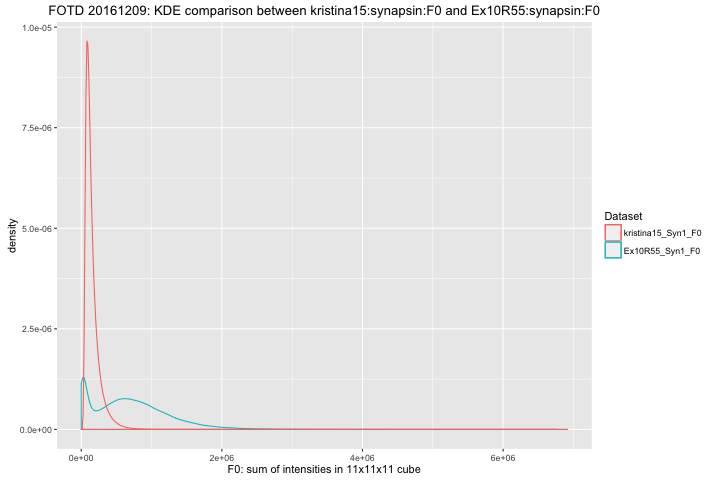

# Figure of the Day: 20161213

First steps with the chessboard dataset have been to extract 
11-cubes about each detected synapse in teh synapsin1_2 channel.

This data was vectorized into an $n \times d$ matrix where 
$n \sim 195000$ adn $d = 11^3$.

This matrix was run through meda which output the following:

- [html](https://mrae.github.io/FOTD/Ex10R55_resulVol1_MEDA.html)
- [Code](code/fotd20161213.r)

## Figure of the Day: 20161212

Starting with the synaptome data, transformed to z-scores then performed
PCA and stored in a matrix X. 

X was then run though IDT and the figure shows the first 4 pcs in a
pairs plot with color based on classification. 

- [Code](code/fotd20161212.Rmd)
- [md](md/fotd20161212.md)
- 

## Figure of the Day: 20161209

Calculating feature F0 (the sum of intensities in an 11x11x11 cube about
the detected synapse) for the Synapsin1 channel from both the Kristina15 and the
chessboard dataset (Ex10R55) I compare their kernel density estimates. 

- [Code](code/fotd20161209.r)
- 

