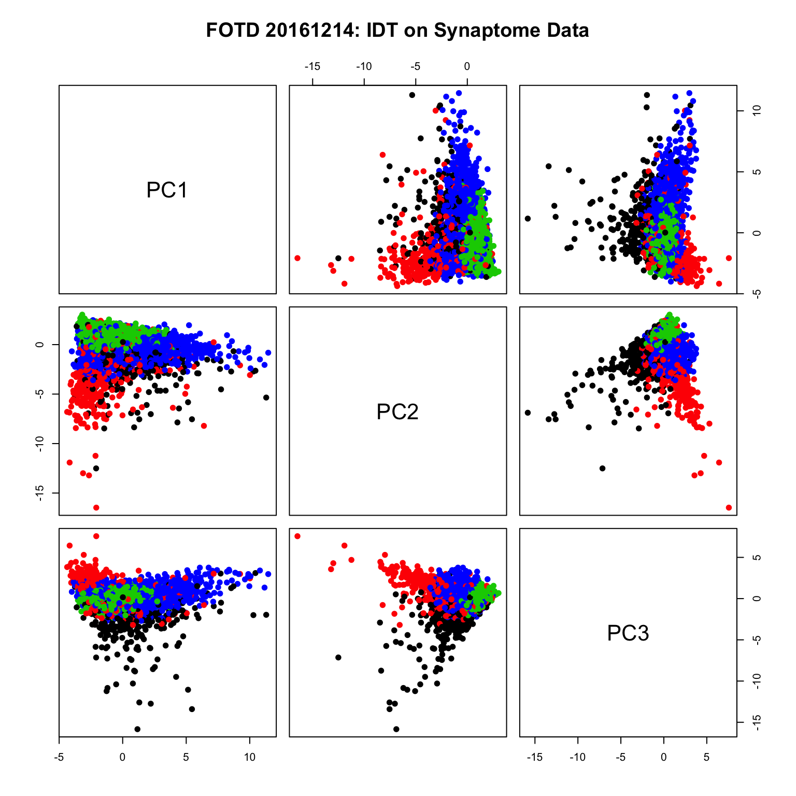

Here we select a random half of the synaptome data, different from the half we have been using.

The data are then z-scored and principal components are computed to the 3rd elbow by Z-G.

``` r
supressMessages(require(meda))
source("~/neurodata/synaptome-stats/Code/doidt.r")
load('~/neurodata/synaptome-stats/Code/cleanDataWithAttributes.RData')
```

``` r
### Setting a seed and creating an index vector
### to select half of the data
#set.seed(2^10)
set.seed(317)
half1 <- sample(dim(data01)[1],dim(data01)[1]/2)
half2 <- setdiff(1:dim(data01)[1],half1)

feat <- data01[half1,]
feat2 <- data01[half2,]

#set.seed(2^10)
set.seed(317)
ss <- sample(dim(data01)[1],10000)
small <- data01[ss, 1:24, with = FALSE]
```

``` r
dat <- small
zfeat <- 
  dat[, lapply(.SD, scale, center = TRUE, scale=TRUE)]

pr2 <- prcomp(zfeat)
#cur <- rCUR::CUR(as.matrix(zfeat), k = 3)@C

(elb <- getElbows(pr2$x, 3, plot = FALSE))
```

    ## [1]  3 18 21

``` r
X <- pr2$x[, 1:elb[3]]

out <- doIDT(as.matrix(X),
             FUN="mclust",
             Dmax=ncol(X), ## max dim for clustering
             Kmax=2,  ## max K for clustering 
             maxsamp=nrow(X), ## max n for clustering
             samp=1, # 1: no sampling, else n/sample sampling
             maxdepth=2, # termination, maximum depth for idt
             minnum=100, # termination, minimum observations per branch
             verbose=TRUE)  
```

    ## ===============================================
    ## Working on branch  1 , depth =  1 ( 2 )
    ## n =  10000 , dim =  21 , dmax =  21 , Kmax =  2 
    ## Clustering in dim =  13, Khat:  2 ,  VVV 
    ## ===============================================
    ## Working on branch  11 , depth =  2 ( 2 )
    ## n =  1915 , dim =  13 , dmax =  13 , Kmax =  2 
    ## Clustering in dim =  16, Khat:  2 ,  VVV 
    ## ===============================================
    ## Working on branch  111 , depth =  3 ( 2 )
    ## n =  821 , dim =  16 , dmax =  16 , Kmax =  2 
    ## ***** LEAF:  111 : (pure,small,deep)=( FALSE , FALSE , TRUE )
    ## 
    ## ===============================================
    ## Working on branch  112 , depth =  3 ( 2 )
    ## n =  1094 , dim =  16 , dmax =  16 , Kmax =  2 
    ## ***** LEAF:  112 : (pure,small,deep)=( FALSE , FALSE , TRUE )
    ## 
    ## 
    ## ===============================================
    ## Working on branch  12 , depth =  2 ( 2 )
    ## n =  8085 , dim =  13 , dmax =  13 , Kmax =  2 
    ## Clustering in dim =  11, Khat:  2 ,  VVV 
    ## ===============================================
    ## Working on branch  121 , depth =  3 ( 2 )
    ## n =  4433 , dim =  11 , dmax =  11 , Kmax =  2 
    ## ***** LEAF:  121 : (pure,small,deep)=( FALSE , FALSE , TRUE )
    ## 
    ## ===============================================
    ## Working on branch  122 , depth =  3 ( 2 )
    ## n =  3652 , dim =  11 , dmax =  11 , Kmax =  2 
    ## ***** LEAF:  122 : (pure,small,deep)=( FALSE , FALSE , TRUE )
    ## 
    ## 
    ## number of leaves (clusters) =  4

``` r
save(X, out, file = "IDTrun20161214_2.RData")
```

``` r
idtlab <- out$class
idtall <- out$idtall
leaves <- which(sapply(idtall, function(x) x$isLeaf))

#sapply(idtall[leaves], function(x) {
#         pairs(X[x$ids, 1:3], col = out$classification[x$ids]); Sys.sleep(3)
#             })

pairs(X[1:5e3,1:3], pch=19,col= idtlab[1:5e3], main ="FOTD 20161214: IDT on Synaptome Data")
```



``` r
#n <- 5e3
#plot3d(X[1:n,1:3], col = idtlab[1:n], size = 15, alpha = 0.5)

idtall <- out$idtall
leaves <- which(sapply(idtall, function(x) x$isLeaf))
nleaves <- G <- length(leaves)
dend <- makeDendrogram(idtall)
plot(dend)
```


