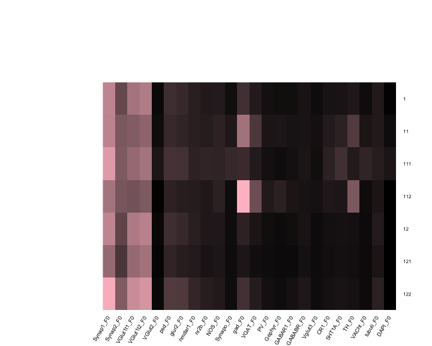
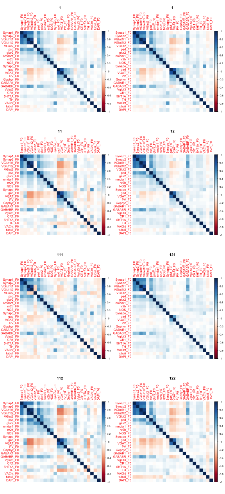

---
title: "Figure of the Day: 20161215"
author: "Jesse Leigh Patsolic"
output: 
  html_document:
    keep_md: true
  md_document:
      variant: markdown_github
      fig_width: 8
      fig_height: 8
      fig_retina: 2
---

Continuing from yesterday's figure (20161214), for each node in the
denoising tree we plot the means and correlation matrices. 

r
require(meda)
source("~/neurodata/synaptome-stats/Code/doidt.r")
load('~/neurodata/synaptome-stats/Code/cleanDataWithAttributes.RData')
load("~/neurodata/FOTD/code/IDTrun20161214_2.RData")


r
idtlab <- out$class
idtall <- out$idtall
leaves <- which(sapply(idtall, function(x) x$isLeaf))

bn <- sapply(idtall, '[[', 2)
obn <- order(bn)

set.seed(317)
half1 <- sample(dim(data01)[1],dim(data01)[1]/2)
half2 <- setdiff(1:dim(data01)[1],half1)

feat <- data01[half1,]
feat2 <- data01[half2,]

#set.seed(2^10)
set.seed(317)
ss <- sample(dim(data01)[1],10000)


r
D1 <- data01[ss, 1:24, with = FALSE]

Y <- lapply(obn, function(x){
         y <- idtall[[x]]$ids
         dat <- D1[y,]
#         dat <- X[y,]
         me <- apply(dat, 2, mean)
         covM <- cov(dat)
         corM <- cor(dat)
         list(means = me, covmat = as.matrix(covM), cormat = as.matrix(corM), bn=bn[x], dat = dat)
})

CovM <- lapply(Y, function(x) x$covmat)
CorM <- lapply(Y, function(x) x$cormat)


## Means for each node in the tree

r
mycol <- colorpanel(100, "black", "pink")
me <- lapply(Y, function(x) apply(x$dat, 2, mean))
me <- Reduce(rbind, me)
rownames(me) <- sort(bn)

heatmap.2(as.matrix(me),dendrogram='none',
          Colv=FALSE,Rowv=FALSE, trace="none", key= FALSE,
          col=mycol, cexRow=0.8, keysize=1.25,
          symkey=FALSE,symbreaks=FALSE,
          scale="none", srtCol=60)


## Correlation matrices for each node in the tree.

r
par(mfrow = c(4,2))
N <- lapply(c(1,1,2,5,3,6,4,7),function(x) { 
             corrplot(CorM[[x]], method = "color", is.corr = TRUE)
             title(bn[obn[x]])
})


